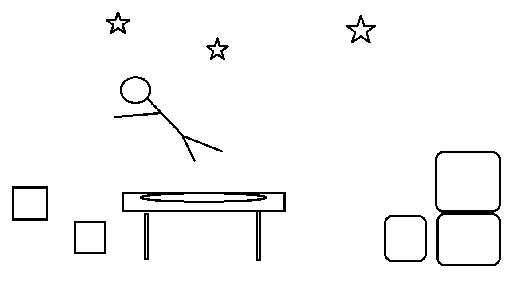
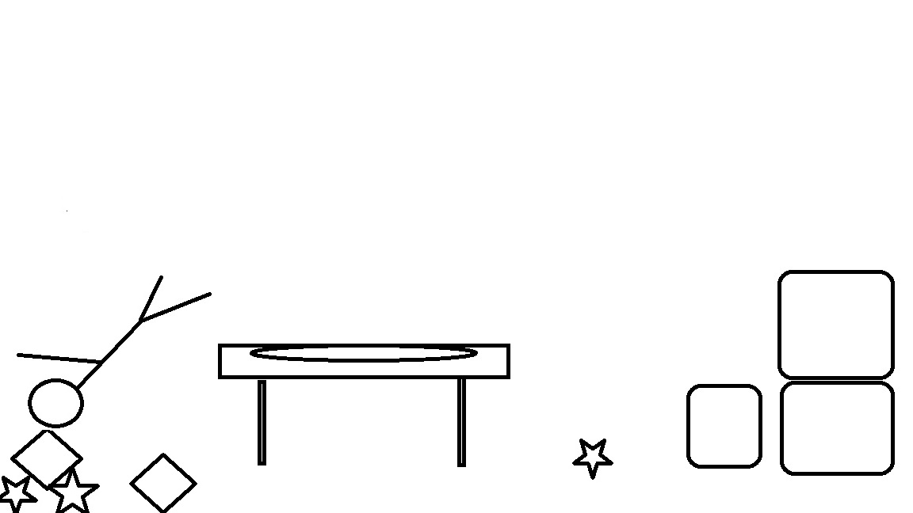

# Trampoline Trauma
## High Concept
Try to cause as much damage as you can by flying off of a trampoline!
## Genre
Trampoline Trauma will be a 2D Strategy game.
## Platform
Universal
## Story
You wake up on top of a mysterious trampoline. How did it get there? How did you get on top of it? Why is someone controlling you and trying to crash you into thing? Wait what! Try to rake up as many points as possible with one jump off of the trampoline by hitting as many objects as you can before you end up stuck on the ground. Buy upgrades to improve your odds of destroying the high score!
## Esthetics
* Graphics will consist of a semi-realistic style.
* The sounds in this game will consist of air sound effects when controlling your character in the air, crashing sounds and a sort of "Oof" sound for the character when you hit objects.
## Gameplay
### Mechanics
* Rotate the character to move him around and hit objects around the zone.
* Upgrade system to improve skills.
* Scoreboard available.
### Controls
* Keyboard:
    * Spacebar to start
    * Shift to rotate to the left
    * Control to rotate to the right
* Mobile:
    * 2 Virtual Buttons to control rotation
### Teaching the game/New user experience aka "Onboarding"
There will be an instructions button in the corner that players can click to learn controls and the objective of the game.
### Player learning
The player will have to learn the best way to get a high score and which upgrades will be best for their strategy.
## Screenshots

## About the Developer
Austin Stone is a 2nd year Game Design and Development Major at RIT looking to get into a AAA company after graduation.
